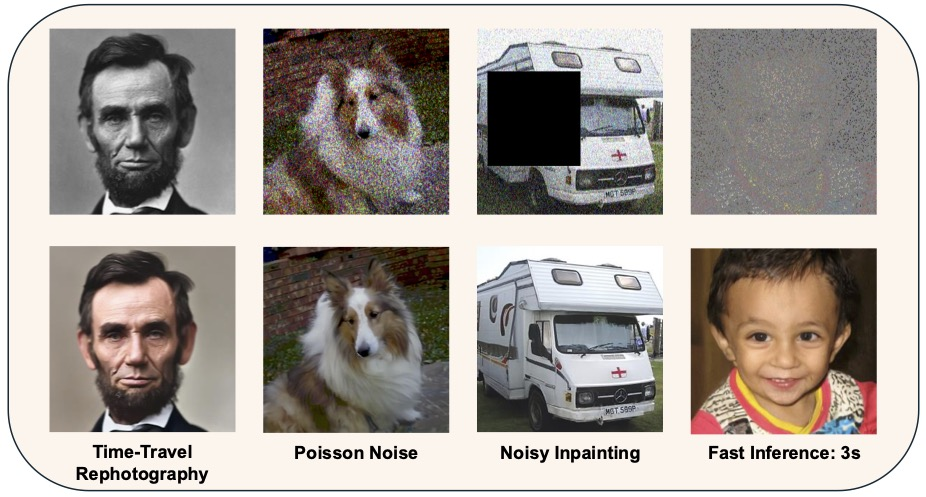

# Constrained Diffusion Implicit Models


## Authors
[Vivek Jayaram](http://www.vivekjayaram.com/), [John Thickstun](https://johnthickstun.com/), [Ira Kemelmacher-Shlizerman](https://homes.cs.washington.edu/~kemelmi/), and [Steve Seitz](https://homes.cs.washington.edu/~seitz/)

## [Project Page](www.google.com)
(Coming Soon)

### [Paper](www.google.com)
(Coming Soon)

### Summary
We solve noisy linear inverse problems with diffusion models. The method is fast and addresses many problems like inpainting, super-resolution, gaussian deblur, and poisson noise. 


## Getting started 

Recommended environment: Python 3.11, Cuda 12, Conda. For lower verions please adjust the dependencies below.

### 1) Clone the repository

```
git clone https://github.com/vivjay30/cdim

cd cdim
```

### 2) Install dependencies

```
conda create -n cdim python=3.11

conda activate cdim

pip install -r requirements.txt

pip install torch==2.4.1+cu124 torchvision-0.19.1+cu124 --extra-index-url https://download.pytorch.org/whl/cu124
```

## Inference Examples
We recommend using the ddpm models from the diffusers library. These are better and can be run without any manual downloading. Model will be downloaded on first run. The run will produce a noisy_measurement.png and output.png. The ouptut directory can be passed as an argument. You can use kl optimization instead of l2 with the `--loss kl` flag.

#### CelebHQ Inpainting Example

`python inference.py sample_images/celebhq_00001.jpg 50 3 operator_configs/box_inpainting_config.yaml noise_configs/gaussian_noise_config.yaml google/ddpm-celebahq-256`
 
#### LSUN Churches Gaussian Deblur Example
`python inference.py sample_images/lsun_church.png 50 3 operator_configs/gaussian_blur_config.yaml noise_configs/gaussian_noise_config.yaml google/ddpm-church-256`
 
#### Poisson Noise Example
`python inference.py sample_images/celebhq_29999.jpg 50 3 operator_configs/identity_operator_config.yaml noise_configs/poisson_noise_config.yaml google/ddpm-celebahq-256 --loss kl --eta-type gradnorm`

#### Discrete KL with Bimodal Noise Example
An example to show discrete KL on a non-standard noise distirbution
`python inference.py sample_images/celebhq_00001.jpg 200 1 operator_configs/box_inpainting_config.yaml noise_configs/bimodal_noise_config.yaml google/ddpm-celebahq-256 --loss categorical_kl --lambda-val 2 --eta-type gradnorm`
 
## FFHQ and Imagenet Models
These models are generally not as strong as the huggingface ddpm models, but are used for comparisons with baseline methods.

From [this link](https://drive.google.com/drive/folders/1jElnRoFv7b31fG0v6pTSQkelbSX3xGZh?usp=sharing), download the checkpoints "ffhq_10m.pt" and "imagenet_256.pt" to models/

#### Imagenet Super Resolution Example
`python inference.py sample_images/imagenet_val_00002.png 50 3 operator_configs/super_resolution_config.yaml noise_configs/gaussian_noise_config.yaml models/imagenet_model_config.yaml`

#### FFHQ Random Inpainting (Faster)
Here we set T=25 and K=1 to show the algorithm running faster
`python inference.py sample_images/ffhq_00010.png 25 1 operator_configs/random_inpainting_config.yaml noise_configs/gaussian_noise_config.yaml models/ffhq_model_config.yaml`

## A note on Eta and Lambda schedules
By default the model tries to use expected gradnorm to set the step size schedule (eta). The gradient magnitudes have been precomputed on the train set and are stored in `etas.json`. However, those values are only valid for the specific tasks and number of steps T and K. When using a different task or step configuration, we fall back to `--eta-type gradnorm` which performs individual step gradient normalization as the value of eta. You can always use that flag, which is a less efficient but more general method.

In addition, the step size schedule eta is scaled by a constant value lambda (the proportionality constant). Getting eta and lambda correct is vital to good convergence, especially with fewer denoising and optimization steps. If you find that the model overfits (loss oscillates wildly) or undefits (loss doesn't go to 0 for KL or sigma^2 for L2), then you should tweak the argument `--lambda-val`. The best guess is printed out for you to use as a starting point.


